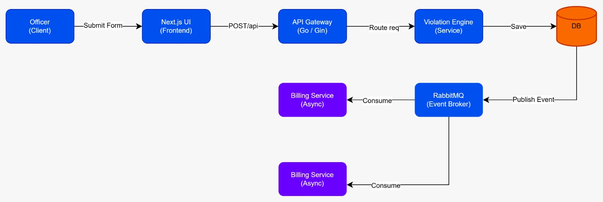
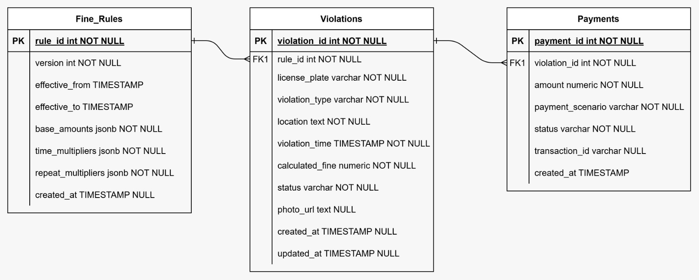

# System Design Document

## 1. Data Flow Description

**Violation Submission & Fine Calculation Flow:**
1. **[Synchronous]** Officer submits the violation form via the Next.js Frontend.
2. **[Synchronous]** The API Gateway routes the `POST /api/violations` request to the Violations Module.
3. **[Synchronous]** The Violations Module calls the Rules Service to fetch the *Active Rule Version*.
4. **[Synchronous]** The Violations Module queries the Violations Database to count previous UNPAID violations for the same license plate in the last 90 days.
5. **[Synchronous]** The Fine Calculation Engine computes the final fine (`Base Amount * Time Multiplier * Repeat Multiplier`).
6. **[Synchronous]** The Violation is saved to the database, explicitly linking the `rule_version_id` to ensure historical immutability.
7. **[Asynchronous]** An event is published to a message broker (e.g., RabbitMQ) indicating a violation was created.
8. **[Asynchronous]** The *Billing Service* consumes this event, creates an official **Invoice**, and saves it.
9. **[Asynchronous]** The *Notification Service* consumes the event and sends an SMS/Email to the registered Member (if known) containing the Invoice details.
10. **[Synchronous]** A success response with the calculated fine is returned to the frontend.

**Payment Processing Flow:**
1. **[Synchronous]** Member initiates payment via the Next.js Frontend Mock Modal.
2. **[Synchronous]** The API Gateway routes the `POST /api/payments` request to the Payments Module.
3. **[Synchronous]** The Payments Module evaluates the mock `scenario` ("success" or "failed").
4. **[Synchronous]** If successful, a mock `transaction_id` is generated, and the Payment record is inserted. The corresponding Violation status is updated to `PAID`.
5. **[Synchronous]** Response returned to the frontend.

---

## 2. Entity-Relationship Diagram (ERD) Blueprint

Below are the structural details to be mapped in your drawing tool (e.g., draw.io).

### Entities and Fields

**Fine_Rules (Versioned Configuration)**
- `id` (PK, Integer)
- `version` (Integer) - *e.g., 1, 2, 3*
- `effective_from` (Timestamp)
- `effective_to` (Timestamp, Nullable) - *If NULL, this is the current active rule*
- `base_amounts` (JSONB)
- `time_multipliers` (JSONB)
- `repeat_multipliers` (JSONB)

**Violations (The Core Transaction)**
- `id` (PK, Integer)
- `license_plate` (Varchar)
- `violation_type` (Varchar)
- `location` (Varchar)
- `violation_time` (Timestamp)
- `rule_version_id` (FK -> Fine_Rules.id) - *CRITICAL: This permanently snapshots the rule used*
- `calculated_fine` (Numeric) - *Pre-calculated to prevent dynamic changes*
- `status` (Varchar) - *'UNPAID' or 'PAID'*

**Payments (Financial Ledger)**
- `id` (PK, Integer)
- `violation_id` (FK -> Violations.id)
- `amount` (Numeric)
- `status` (Varchar) - *'SUCCESS' or 'FAILED'*
- `transaction_id` (Varchar)

### Relationships

1. **Fine_Rules to Violations (1 : N)**
   - One rule version can apply to many violations.
   - A violation belongs to EXACTLY ONE rule version (`rule_version_id`).
   - *Design Note:* By not linking directly to the "current" rule, but instead hard-linking to the specific historical row ID, we guarantee that past fine calculations remain pristine.

2. **Violations to Payments (1 : N)**
   - One violation can have multiple payment attempts (e.g., a failed attempt followed by a successful one).
   - A payment attempt belongs to exactly one violation.
